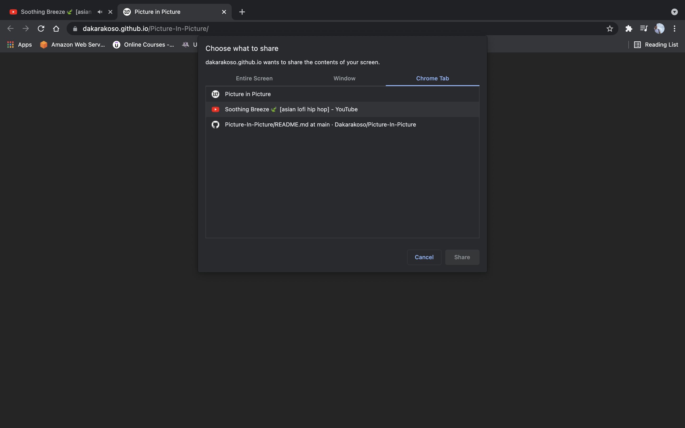

 <h1 align="center">Picture in Picture</h1>

[![LinkedIn][linkedin-shield]][linkedin-url]

<!-- PROJECT LOGO -->
 

    
  </a>

  <h3 align="center">Picture in Picture</h3>
 

### LIVE

https://dakarakoso.github.io/Picture-In-Picture/

<!-- TABLE OF CONTENTS -->

## Table of contents

  <ol>
    <li>
      <a href="#about-the-project">About The Project</a>
      <ul>
        <li><a href="#built-with">Built With</a></li>
      </ul>
    </li>
    <li><a href="#usage">Usage</a></li>
    <li><a href="#contact">Contact</a></li>
  </ol>

<!-- ABOUT THE PROJECT -->

## About The Project

This is a random Picture in Picture. In this project, I used an asynchronous fetch request to arrest API in order to get random quotes. Users can press the button "new quote" and get different quotes. They can also share the quote in Twitter by pressing the button on the left.

### Built With

- Html
- CSS
- JavaScript
- [Picture-in-Picture Web API](https://css-tricks.com/an-introduction-to-the-picture-in-picture-web-api/)

## Usage

<!-- CONTACT -->

## Contact

Willian Negishi - willian_jvm@hotmail.com
Project Link: [https://github.com/Dakarokoso/Picture-In-Picture](https://github.com/Dakarakoso/Picture-In-Picture/)

<!-- MARKDOWN LINKS & IMAGES -->
<!-- https://www.markdownguide.org/basic-syntax/#reference-style-links -->

[linkedin-shield]: https://img.shields.io/badge/-LinkedIn-black.svg?style=for-the-badge&logo=linkedin&colorB=555
[linkedin-url]: https://www.linkedin.com/in/willian-negishi-2829a4172/
